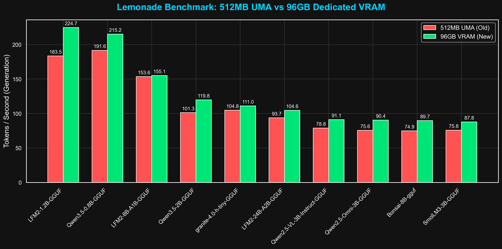

# Lemonade Benchmarks on AMD Strix Halo (Z13)

## 1. Executive Summary
This repository presents a deep dive into the performance of the Lemonade Local AI Stack on the Next-Gen AMD Ryzen AI Max+ 395 (Strix Halo). By comparing the dynamic 512MB UMA buffer layout against an aggressive 96GB Dedicated VRAM carve-out, we demonstrate that dedicated VRAM eliminates arbitration overhead, resulting in substantial generation and prefill performance gains across 38 evaluated models. 

## 2. Hardware & Software Environment
- **Hardware Platform:** ASUS ROG Flow Z13 GZ302EA (2-in-1 Tablet/Laptop)
- **CPU:** AMD Ryzen AI Max+ 395 (16 Cores / 32 Threads, Zen 5 Architecture)
- **GPU:** Integrated AMD Radeon 8060S (40 Compute Units, RDNA 3.5 Architecture, gfx1151)
- **Memory Configuration:** 128 GB LPDDR5x with **96GB Dedicated VRAM** carve-out
- **Software Stack:** Fedora 43 (KDE Plasma), Lemonade Server v10.4.0 (`llamacpp` `rocm-preview` + Vulkan)

## 3. Key Findings & Memory Subsystem Scaling
Our test suite ran 38 different state-of-the-art models on two contrasting system-level memory configurations.

- **Universal Performance Uplift:** Every model tested saw a throughput increase. Generation speed averaged a 10% gain, while the Time-to-First-Token (TTFT) and prompt prefill phases surged up to 38% faster.
- **SSM Supremacy:** The LFM2-1.2B State Space Model leveraged the dedicated VRAM bandwidth remarkably, soaring to an interactive speed of **224.7 tokens/second**.
- **Dense >15B Parameter "Wall":** We identified a Vulkan compute kernel limitation on dense models >15B parameters, which plateau at 9-14 tok/s. Despite this ceiling, the TTFT significantly decreased by 20-30%, dramatically improving the "snappiness" of these models.

## 4. Sponsorship & Contact
We are actively seeking hardware and financial sponsorships to expand testing across upcoming hardware architectures, including Lunar Lake, Kraken Point, and RTX 50-series platforms.

For review requests, architecture benchmarking, and collaboration inquiries, please connect with me via LinkedIn:
**[Roland Pascua](https://www.linkedin.com/in/rolpascua/)**
